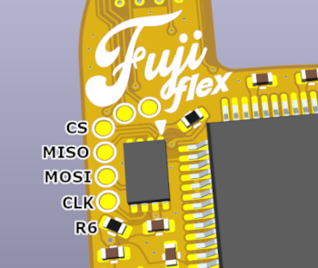

<picture> <source media="(prefers-color-scheme: dark)" srcset="images/logo.png">  </picture> 

OSHW GCVideo DVI flex for Nintendo Wii. Tested and working! Solderpad Hardware License v2.1


Special thanks to [loopj](https://github.com/loopj) for testing the FPC and writing the assembly+install documentation!

## fujiflex features
- [x] Compact 28 x 30mm 2-layer flex PCB (requires KiCAD 8.0 or later)
- [x] ~$10 BOM cost
- [x] Powered from 3.3V and 1.8V (1.2V generated from 1.8V)
- [x] 19-pin Molex 5052781933 / 5052781970 ZIF for HDMI output
- [x] Wii SDA and SCL testpoints
- [x] MODE solder jumper
- [x] Powered by [Ingo Korb's](https://github.com/ikorb) [GCVideo DVI](https://github.com/ikorb/gcvideo/)


## Parts Procurement & Assembly
I maintain [a Mouser project](https://www.mouser.com/ProjectManager/ProjectDetail.aspx?AccessID=5589d512f3) with most of the BOM. You still need to source the FPGA from elsewhere. I suggest either [LCSC](https://www.lcsc.com/product-detail/Programmable-Logic-Device-CPLDs-FPGAs_XILINX-XC3S200A-4VQG100C_C1521645.html), [AliExpress](https://www.aliexpress.us/item/3256805017536134.html), or [Taobao](https://item.taobao.com/item.htm?abbucket=5&id=749261010737&ns=1&spm=a21n57.1.0.0.2b93523ch7BSfI).

The total BOM cost for fujiflex is around 10USD. **If you're paying more than $5 per FPGA, you are being ripped off!**

- Order the FPC with 0.5oz/in² copper! If ordering from JLCPCB, you must choose 0.12mm FPC thickness in order to select 0.5oz/in² copper.
- A steel solderpaste stencil with etching or electropolishing is highly recommended for assembly. JLCPCB is a good source.
- If you intend to program the SPI flash in-system, do not place R6.

## Flashing GCVideo

Once assembled, you'll need to flash the GCVideo bitstream. The cheap 'n' easy approach is to program *in-system* using a SPI flash programmer (EZP20xx, CH341A-based, RPi Pico) soldered to the testpads on fujiflex.

- Remove R6 to avoid powering the FPGA during programming
- Wire the CS, MISO, MOSI, CLK, and GND pads to the corresponding pins on your SPI flash programmer
- Wire the rightmost pad of R6 to 3.3V on your SPI flash programmer
- Download the *shuriken-v3-wii* bitstream from [GCVideo's latest release](https://github.com/ikorb/gcvideo/releases/latest)
- Write the bitstream (eg. `gcvideo-dvi-shuriken-v3-wii-3.1-spirom-complete.bin`) to the SPI flash (see below)
- Populate R6 (0402 0Ω)



### EZP20xx programmers

If you are using an EZP20xx programmer, you can flash the bitstream using the [Windows software](https://www.chipsetpro.com/en/content/7-download-software) for these devices.

### Other programmers (using `flashrom`)

For other programmers, [flashrom](https://flashrom.org) is an open source command line tool for programming flash chips which supports [tons of devices](https://wiki.flashrom.org/Supported_programmers), including the inexpensive CH341A-based boards.

First expand the GCVideo bitstream to match the size of the SPI flash chip:

```sh
fallocate -l 512k gcvideo-dvi-shuriken-v3-wii-3.1-spirom-complete.bin
````

Then flash the bitstream, for example with a CH341A programmer:

```sh
flashrom --programmer ch341a_spi -w gcvideo-dvi-shuriken-v3-wii-3.1-spirom-complete.bin
```

### Socket adapters

You can also use a DFN8 2x3mm socket to program the SPI flash before soldering it to the board. [Type 1](https://www.aliexpress.us/item/3256802266989931.html), [Type 2](https://www.aliexpress.us/item/3256801780444965.html)

## Installation

fujiflex is soldered directly to the [digital A/V vias](https://github.com/ikorb/gcvideo/blob/main/HDL/gcvideo_dvi/README-Wii.md#digital-audio-and-video) on a 4-layer Wii motherboard.

- Align and solder fujiflex to the GPU vias
- Wire the 1.8V, 3.3V, 5V, and GND pads
- To use a Gamecube controller for navigating the GCVideo OSD, you'll also need to [wire the GCC pad](https://github.com/ikorb/gcvideo/blob/main/HDL/gcvideo_dvi/README-Wii.md#controller) (or [via](https://bitbuilt.net/forums/index.php?threads/the-definitive-wii-trimming-guide.198/#:~:text=GameCube%20controllers%E2%80%8B,GameCube%20controllers)).

Install by [loopj](https://github.com/loopj):


## License

Solderpad Hardware License v2.1
